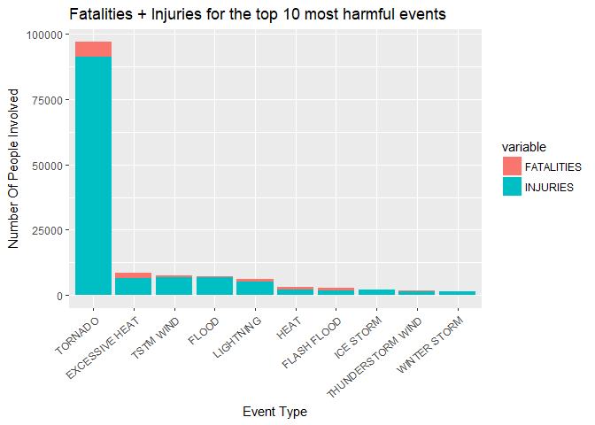
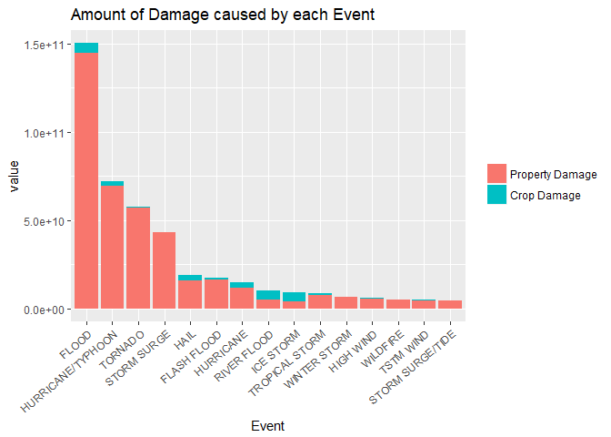

## Synopsis

This report will answer two questions about weather events using the NOAA Storm Database

**Questions**:

1. Which types of events (as indicated in the EVTYPE variable) are most harmful with respect to population health across the United States?
2. Which types of events have the greatest economic consequences across the United States? 

### Introduction

Storms and other severe weather events can cause both public health and economic problems for communities and municipalities. Many severe events can result in fatalities, injuries, and property damage, and preventing such outcomes to the extent possible is a key concern.

This project involves exploring the U.S. National Oceanic and Atmospheric Administration's (NOAA) storm database. This database tracks characteristics of major storms and weather events in the United States, including when and where they occur, as well as estimates of any fatalities, injuries, and property damage.


## Data Processing

Load package dependencies and data

```r
library(knitr)
library(ggplot2)
library(dplyr)
library(reshape2)
```


```r
db_url <- "https://d396qusza40orc.cloudfront.net/repdata%2Fdata%2FStormData.csv.bz2"   
db_zip <- "StormData.csv.bz2"
if (!file.exists(db_zip)) {    
    download.file(db_url, db_zip, method="curl")    
}  

df <- read.csv("StormData.csv.bz2")
```

Taking a look at all the variables wee see that many are not relevant por the questions we are trying to answer and so we can subset the dataframe by just including the variables that we are interested in saved in the vector "cols".


```r
str(df)
```

```
## 'data.frame':	902297 obs. of  37 variables:
##  $ STATE__   : num  1 1 1 1 1 1 1 1 1 1 ...
##  $ BGN_DATE  : Factor w/ 16335 levels "1/1/1966 0:00:00",..: 6523 6523 4242 11116 2224 2224 2260 383 3980 3980 ...
##  $ BGN_TIME  : Factor w/ 3608 levels "00:00:00 AM",..: 272 287 2705 1683 2584 3186 242 1683 3186 3186 ...
##  $ TIME_ZONE : Factor w/ 22 levels "ADT","AKS","AST",..: 7 7 7 7 7 7 7 7 7 7 ...
##  $ COUNTY    : num  97 3 57 89 43 77 9 123 125 57 ...
##  $ COUNTYNAME: Factor w/ 29601 levels "","5NM E OF MACKINAC BRIDGE TO PRESQUE ISLE LT MI",..: 13513 1873 4598 10592 4372 10094 1973 23873 24418 4598 ...
##  $ STATE     : Factor w/ 72 levels "AK","AL","AM",..: 2 2 2 2 2 2 2 2 2 2 ...
##  $ EVTYPE    : Factor w/ 985 levels "   HIGH SURF ADVISORY",..: 834 834 834 834 834 834 834 834 834 834 ...
##  $ BGN_RANGE : num  0 0 0 0 0 0 0 0 0 0 ...
##  $ BGN_AZI   : Factor w/ 35 levels "","  N"," NW",..: 1 1 1 1 1 1 1 1 1 1 ...
##  $ BGN_LOCATI: Factor w/ 54429 levels "","- 1 N Albion",..: 1 1 1 1 1 1 1 1 1 1 ...
##  $ END_DATE  : Factor w/ 6663 levels "","1/1/1993 0:00:00",..: 1 1 1 1 1 1 1 1 1 1 ...
##  $ END_TIME  : Factor w/ 3647 levels ""," 0900CST",..: 1 1 1 1 1 1 1 1 1 1 ...
##  $ COUNTY_END: num  0 0 0 0 0 0 0 0 0 0 ...
##  $ COUNTYENDN: logi  NA NA NA NA NA NA ...
##  $ END_RANGE : num  0 0 0 0 0 0 0 0 0 0 ...
##  $ END_AZI   : Factor w/ 24 levels "","E","ENE","ESE",..: 1 1 1 1 1 1 1 1 1 1 ...
##  $ END_LOCATI: Factor w/ 34506 levels "","- .5 NNW",..: 1 1 1 1 1 1 1 1 1 1 ...
##  $ LENGTH    : num  14 2 0.1 0 0 1.5 1.5 0 3.3 2.3 ...
##  $ WIDTH     : num  100 150 123 100 150 177 33 33 100 100 ...
##  $ F         : int  3 2 2 2 2 2 2 1 3 3 ...
##  $ MAG       : num  0 0 0 0 0 0 0 0 0 0 ...
##  $ FATALITIES: num  0 0 0 0 0 0 0 0 1 0 ...
##  $ INJURIES  : num  15 0 2 2 2 6 1 0 14 0 ...
##  $ PROPDMG   : num  25 2.5 25 2.5 2.5 2.5 2.5 2.5 25 25 ...
##  $ PROPDMGEXP: Factor w/ 19 levels "","-","?","+",..: 17 17 17 17 17 17 17 17 17 17 ...
##  $ CROPDMG   : num  0 0 0 0 0 0 0 0 0 0 ...
##  $ CROPDMGEXP: Factor w/ 9 levels "","?","0","2",..: 1 1 1 1 1 1 1 1 1 1 ...
##  $ WFO       : Factor w/ 542 levels ""," CI","$AC",..: 1 1 1 1 1 1 1 1 1 1 ...
##  $ STATEOFFIC: Factor w/ 250 levels "","ALABAMA, Central",..: 1 1 1 1 1 1 1 1 1 1 ...
##  $ ZONENAMES : Factor w/ 25112 levels "","                                                                                                               "| __truncated__,..: 1 1 1 1 1 1 1 1 1 1 ...
##  $ LATITUDE  : num  3040 3042 3340 3458 3412 ...
##  $ LONGITUDE : num  8812 8755 8742 8626 8642 ...
##  $ LATITUDE_E: num  3051 0 0 0 0 ...
##  $ LONGITUDE_: num  8806 0 0 0 0 ...
##  $ REMARKS   : Factor w/ 436781 levels "","-2 at Deer Park\n",..: 1 1 1 1 1 1 1 1 1 1 ...
##  $ REFNUM    : num  1 2 3 4 5 6 7 8 9 10 ...
```

```r
cols <- c("EVTYPE", "FATALITIES", "INJURIES", "CROPDMG", "CROPDMGEXP", "PROPDMG", "PROPDMGEXP")
dat <- df[,cols]
```

The seven variables used for the analysis are the following:

- EVTYPE: Event type
- FATALITIES: number of fatalities from the event
- INJURIES: number of injuries from the event
- CROPDMG: number of crop damage from event
- CROPDMGEXP: crop damage multiplier from the event
- PROPDMG: number of property damage from event
- PROPDMGEXP: property damage multiplier from the event

In the following part the variables for PROPDMGEXP and CROPDMGEXP will be transformed into values that can be worked with. The explanation on this values can be taken from the discussion forums in coursera. The explanation of this values is out of the purpose of this work. 


```r
# Show level of Expenses
levels(dat$PROPDMGEXP)
```

```
##  [1] ""  "-" "?" "+" "0" "1" "2" "3" "4" "5" "6" "7" "8" "B" "h" "H" "K"
## [18] "m" "M"
```

```r
# Data Cleansing
# Digits
dat$CROPDMGEXP <- gsub("[[:digit:]]", "10", dat$CROPDMGEXP)    
dat$PROPDMGEXP <- gsub("[[:digit:]]", "10", dat$PROPDMGEXP)
## +    
dat$CROPDMGEXP <- gsub("\\+", "1", dat$CROPDMGEXP)    
dat$PROPDMGEXP <- gsub("\\+", "1", dat$PROPDMGEXP)    
## -,?  
dat$CROPDMGEXP <- gsub("[-\\?]", "0", dat$CROPDMGEXP)    
dat$PROPDMGEXP <- gsub("[-\\?]", "0", dat$PROPDMGEXP)    
# Change the levels for the H, K, M, B
dat$PROPDMGEXP <- gsub("[Hh]","100",dat$PROPDMGEXP)
dat$PROPDMGEXP <- gsub("[Kk]","1000",dat$PROPDMGEXP)
dat$PROPDMGEXP <- gsub("[Mm]","1000000",dat$PROPDMGEXP)
dat$PROPDMGEXP <- gsub("[Bb]","1000000000",dat$PROPDMGEXP)  
dat$CROPDMGEXP <- gsub("[Hh]","100",dat$CROPDMGEXP)
dat$CROPDMGEXP <- gsub("[Kk]","1000",dat$CROPDMGEXP)
dat$CROPDMGEXP <- gsub("[Mm]","1000000",dat$CROPDMGEXP)
dat$CROPDMGEXP <- gsub("[Bb]","1000000000",dat$CROPDMGEXP) 
# Empty values
dat$PROPDMGEXP[dat$PROPDMGEXP == ""] <- 0
dat$CROPDMGEXP[dat$CROPDMGEXP == ""] <- 0
# Parse values as numeric
dat$PROPDMGEXP <- as.numeric(dat$PROPDMGEXP)
dat$CROPDMGEXP <- as.numeric(dat$CROPDMGEXP)
# Calculate the total damage
dat <- mutate(dat,PROPEXPTOTAL = PROPDMGEXP*PROPDMG)
dat <- mutate(dat,CROPEXPTOTAL = CROPDMGEXP*CROPDMG)
```

## Results


### Which types of events (as indicated in the EVTYPE variable) are most harmful with respect to population health across the United States?


```r
fatalities_and_injuries_per_event <- aggregate(cbind(FATALITIES,INJURIES)~EVTYPE,dat,sum,na.rm=TRUE)
tmpdata <- arrange(fatalities_and_injuries_per_event, desc(FATALITIES + INJURIES))[1:10,]
tmpdata <- melt(tmpdata,id.vars = "EVTYPE")
g<- ggplot(tmpdata, aes(x = reorder(EVTYPE,-value), y = value, fill = variable))
g + geom_bar(stat="identity") + labs(title = "Fatalities + Injuries for the top 10 most harmful events",
                                     x = "Event Type", y="Number Of People Involved")+
    theme(axis.text.x = element_text(angle = 40, hjust = 1))
```

<!-- -->

With help of the past visualization it is clear that the tornados are the most harmful type of event in the USA both in number of fatalities and injuries. The table below shows a summary for the top ten events with a number of fatalities, injuries and the total number of people affected by the event.


```r
table_data <- mutate(fatalities_and_injuries_per_event, TOTAL = FATALITIES + INJURIES)
table_data <- arrange(table_data, desc(FATALITIES + INJURIES))[1:10,]
table_data <- format(table_data, big.mark = ",", decimial.mark = ".")

kable(table_data, format="html", col.names=c("Event Type", "Fatalities", "Injuries", "Total"), 
      align=c("l", "r", "r", "r"))   
```

<table>
 <thead>
  <tr>
   <th style="text-align:left;"> Event Type </th>
   <th style="text-align:right;"> Fatalities </th>
   <th style="text-align:right;"> Injuries </th>
   <th style="text-align:right;"> Total </th>
  </tr>
 </thead>
<tbody>
  <tr>
   <td style="text-align:left;"> TORNADO </td>
   <td style="text-align:right;"> 5,633 </td>
   <td style="text-align:right;"> 91,346 </td>
   <td style="text-align:right;"> 96,979 </td>
  </tr>
  <tr>
   <td style="text-align:left;"> EXCESSIVE HEAT </td>
   <td style="text-align:right;"> 1,903 </td>
   <td style="text-align:right;"> 6,525 </td>
   <td style="text-align:right;"> 8,428 </td>
  </tr>
  <tr>
   <td style="text-align:left;"> TSTM WIND </td>
   <td style="text-align:right;"> 504 </td>
   <td style="text-align:right;"> 6,957 </td>
   <td style="text-align:right;"> 7,461 </td>
  </tr>
  <tr>
   <td style="text-align:left;"> FLOOD </td>
   <td style="text-align:right;"> 470 </td>
   <td style="text-align:right;"> 6,789 </td>
   <td style="text-align:right;"> 7,259 </td>
  </tr>
  <tr>
   <td style="text-align:left;"> LIGHTNING </td>
   <td style="text-align:right;"> 816 </td>
   <td style="text-align:right;"> 5,230 </td>
   <td style="text-align:right;"> 6,046 </td>
  </tr>
  <tr>
   <td style="text-align:left;"> HEAT </td>
   <td style="text-align:right;"> 937 </td>
   <td style="text-align:right;"> 2,100 </td>
   <td style="text-align:right;"> 3,037 </td>
  </tr>
  <tr>
   <td style="text-align:left;"> FLASH FLOOD </td>
   <td style="text-align:right;"> 978 </td>
   <td style="text-align:right;"> 1,777 </td>
   <td style="text-align:right;"> 2,755 </td>
  </tr>
  <tr>
   <td style="text-align:left;"> ICE STORM </td>
   <td style="text-align:right;"> 89 </td>
   <td style="text-align:right;"> 1,975 </td>
   <td style="text-align:right;"> 2,064 </td>
  </tr>
  <tr>
   <td style="text-align:left;"> THUNDERSTORM WIND </td>
   <td style="text-align:right;"> 133 </td>
   <td style="text-align:right;"> 1,488 </td>
   <td style="text-align:right;"> 1,621 </td>
  </tr>
  <tr>
   <td style="text-align:left;"> WINTER STORM </td>
   <td style="text-align:right;"> 206 </td>
   <td style="text-align:right;"> 1,321 </td>
   <td style="text-align:right;"> 1,527 </td>
  </tr>
</tbody>
</table>

### Which types of events have the greatest economic consequences across the United States? 

The same logic as the question before will be applied to see which type of event causes the most damages in the country. For this the expenses that will be used. This variables were calculated in the _Data Preprocessing_ section.


```r
expenses_per_event <- aggregate(cbind(PROPEXPTOTAL, CROPEXPTOTAL) ~ EVTYPE, dat, sum)
names(expenses_per_event) <- c("EVTYPE","Property.Damage","Crop.Damage")
expenses_per_event <- arrange(expenses_per_event, desc(Property.Damage, Crop.Damage))[1:15,]

tmpdata <- melt(expenses_per_event, id.vars = "EVTYPE")

g <- ggplot(tmpdata, aes(x=reorder(EVTYPE,-value),y=value,group = "variable",fill = variable))
g + geom_bar(stat = "identity") + theme(axis.text.x = element_text(angle = 40, hjust = 1)) + 
    labs(title = "Amount of Damage caused by each Event", x = "Event","Damage") + 
    scale_fill_discrete(name = "",labels = c("Property Damage","Crop Damage"))
```

<!-- -->


