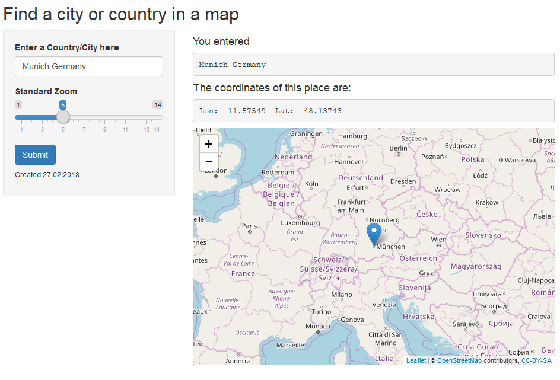

```{r setup, include=FALSE}
knitr::opts_chunk$set(echo = FALSE, warning = FALSE, message = FALSE)
library(ggmap)
library(leaflet)
```

## The Problem

You probably know where the United States is BUT do you know where to find Botswana?
Did you ever wanted to search for a place but do not let google know that you are looking for it?

How would you possibly do this?

```{r}
coords <- geocode("United States", source = "dsk")
coords %>% 
    leaflet()%>%
    addTiles() %>%
    addMarkers() %>%
    setView(coords$lon, coords$lat, zoom = 4)

```


## The Answer

The answer to your problems is an **AWSOME** Shiny application which will solve your problems. Using Leaflet and its Open Street Map we can find every city in the world.

There is no more need to wonder how to find Botswana.

```{r}
coords <- geocode("botswana", source = "dsk")
coords %>% 
    leaflet()%>%
    addTiles() %>%
    addMarkers() %>%
    setView(coords$lon, coords$lat, zoom = 4)
```

## Best App
Use this shiny app to find every place in the world in an interactive way!



## End
Please rate this app with FIVE STARS! :D
